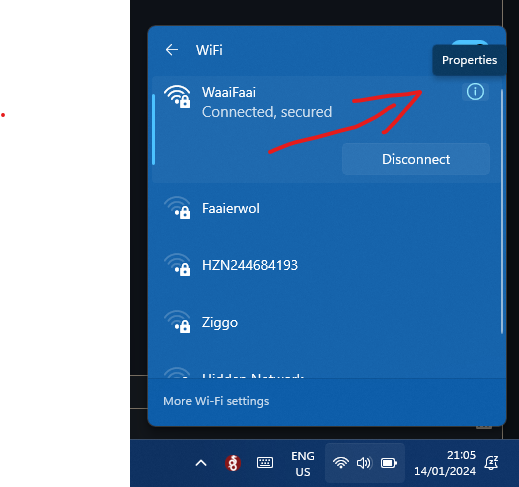

# Wireguard VPN
Super easy to use VPN server in a docker container

## Clients
Full list can be found [here](https://www.wireguard.com/install/): 

https://www.wireguard.com/install/

Clients:

[Macos (app store)](https://itunes.apple.com/us/app/wireguard/id1451685025?ls=1&mt=12)

[iOS (app store)](https://itunes.apple.com/us/app/wireguard/id1441195209?ls=1&mt=8)

[Windows Installer](https://download.wireguard.com/windows-client/wireguard-installer.exe)

# Before deployment
## Dynamic DNS
Link a uri to you public ip

Popular dns providers are [duckdns](https://www.duckdns.org/) and [freedns](https://freedns.afraid.org/) 
They let you link you ip to a domain name of them. eg. https://somename.duckdns.org/
This will let you route traffic back home.
To find your public IP (you must be on your home network and) simply google ['What is my IP'](https://www.google.nl/search?q=what+is+my+ip)

_After you have created an account and requested a subdomain,_ Enter the ip you googled before in the subdomain settings. 

__don't forget to update the created subdomain in de docker-compose.yml file__

## Router
Go to your router's home page

### Default Addresses

Common: [http://192.168.1.1](http://192.168.1.1) <br>
Ziggo: [http://192.168.178.1](http://192.168.178.1)

### Find router address on mac & linux

Open the terminal

> mac keyboard shortcut <br>
> " CMND + ALT + T "

> linux keyboard shortcut <br>
> " CTRL + ALT + T "

Copy/paste command and hit enter

```bash
ifconfig
```

Your active network connection will tell you which IP it has assigned.

The names will probably be simmilar to "wlan0" for wifi and "eth0" for ethernet connection.

The address of the router will be the same 3 starting numbers but the last is "1" for the router

> eg. if your ip is "192.168.1.153", your router will be at "192.168.1.1"

### Find router address on Windows

Press the wifi or network icon on the right in the taskbar.

Press the arrow ">" next to the wifi or network icon.

Press the info icon "ⓘ" next to your active connection



Scroll down to "IPv4 address". This is the ip address of your PC


The address of the router will be the same 3 starting numbers but the last is "1" for the router.

eg. if your ip is "192.168.1.153", your router will be at "192.168.1.1"

> My router also does DNS hence my IPv4 DNS servers shows the IP of the router. <br>
> __This is not necessarily your case.__

### Log in

Enter your router's address in any web browser. <br>
Log in as "admin" user unless specified differently on the device

> Can't remember setting password? The default password is on the back of your router. <br>
> If its not, try the wifi password. <br>
> If that fails, check the brand of your router and google "default password MyRouterBrand". <br> 
> If that didn't work, replace "MyRouterBrand" with the brand of your router...

### Port Forwarding

Go to Advanced Settings -> Security -> Port Forwarding


Press 
> Create New Rule

Add your IP 
> 192.168.178.20

Enter port "51820" 4 times (Sometimes only start and end port, so 2 times)

Choose "UDP" protocol

And set to enabled 

_Add Rule -> Apply Changes_


# Deploy

If you did not clone this repo, first create a folder. 
> Can be named freely <br>
> eg. "wireguardvpn"

Copy the path to replace the "FOLDER" environment variable in your ".env" file later. 

Then create an additional folder inside the just created named "wg-easy".

> __MUST__ be named __"wg-easy"__ or don't forget to edit the volume in your docker-compose.yml if you feel like you know what you're doing.

```bash
$ mkdir ~/wireguardvpn
$ mkdir ~/wireguardvpn/wg-easy
```

## Deploying Container with portainer
Browse to your pi's IP on port '9000' to go to portainer 'http://<ip_address_pi>:9000'

```
http://192.168.178.20:9000
```
Press 'local' 


In the taskbar on the left, press:

> stacks

> new stack

Enter name 'wireguardvpn' _(no capitols or characters)_

Copy/paste docker-compose.yml into the editor field

Fill in environment variables. If you didn't clone this repo, edit the variables to your local setup

press "_deploy stack_"

This could take a minute. A green (or red) notification will appear in the right upper corner of the screen when it is finished.

1. If it was green, all went well.

    - To access the wireguard admin page, go to 'http://<ip_address_pi>:51821' 
    > e.g. [http://192.168.178.20:51821](http://192.168.178.20:51821)


2. If the notification after deployment was red however, something went wrong. 
Probably a faulty indentation when copy/pasting.

    Solutions?
    - Google
    - Call G

# docker-compose.yml
The file that tells docker-compose what to do

## Deploy with docker-compose
Open a terminal or similar CLI
> If you don't have docker-compose installed, ask google. If you're on a raspberry pi, check my [docker-install repo](https://github.com/4086449/docker-install)

### To start / stop
__ALWAYS__ make sure you are in the same folder that contains your 'docker-compose.yml' file. <br>
__NEVER__ change the name 'docker-compose.yml'

```
docker-compose up -d
docker-compose down
```
> -d for detached. Curious? Try without (stop -> ctrl + c) 

### docker-compose.yml

```
version: "3.8"
services:
  wg-easy:
    environment:
      # ⚠️ Required:
      # Change this to your host's public address
      - WG_HOST=${HOST_URL}

      # Optional:
      # - PASSWORD=foobar123
      # - WG_PORT=51820
      # - WG_DEFAULT_ADDRESS=10.8.0.x
      # - WG_DEFAULT_DNS=1.1.1.1
      # - WG_MTU=1420
      # - WG_ALLOWED_IPS=192.168.15.0/24, 10.0.1.0/24
      # - WG_PRE_UP=echo "Pre Up" > /etc/wireguard/pre-up.txt
      # - WG_POST_UP=echo "Post Up" > /etc/wireguard/post-up.txt
      # - WG_PRE_DOWN=echo "Pre Down" > /etc/wireguard/pre-down.txt
      # - WG_POST_DOWN=echo "Post Down" > /etc/wireguard/post-down.txt
      - WG_ALLOWED_IPS=0.0.0.0/0, ::0
      
    image: weejewel/wg-easy
    container_name: wg-easy
    volumes:
      - ${FOLDER}/wg-easy:/etc/wireguard
    ports:
      - 51820:51820/udp
      - 51821:51821/tcp
    restart: unless-stopped
    cap_add:
      - NET_ADMIN
      - SYS_MODULE
    sysctls:
      - net.ipv4.ip_forward=1
      - net.ipv4.conf.all.src_valid_mark=1
    extra_hosts:
      - "host.docker.internal:host-gateway"
```

# Environment Variables
Copy these variables (and edit if necessary) and <br>
paste them in portainer 
> scroll down below the field of the docker-compose.yml <br>
> press advanced mode or copy/paste the variables one by one

>or create a file called ".env" in the same folder as your docker-compose.ynl.
## Example .env file
```.env
FOLDER=/home/pi/wireguardvpn
HOST_URL=https://somename.duckdns.org
VPN_PORT=51822
WEB_PORT=51821
```

## To Change
### Mandatory
- HOST_URL: to your ddns address (see above: Dynamic dns)

### Optional
- ports: you can change the port of the webpage '51821' to an easier to remember number like "12345:51821". Only change the host port ("host_port:container_port"). HOWEVER, __NEVER__ change the wireguard port '51820' unless you feel confident you know what you are doing.
- volumes: change the host folder mapping if you did __not__ clone this repo __and__ you chose a different folder name earlier in this file.

# More info
https://github.com/WeeJeWel/wg-easy/
